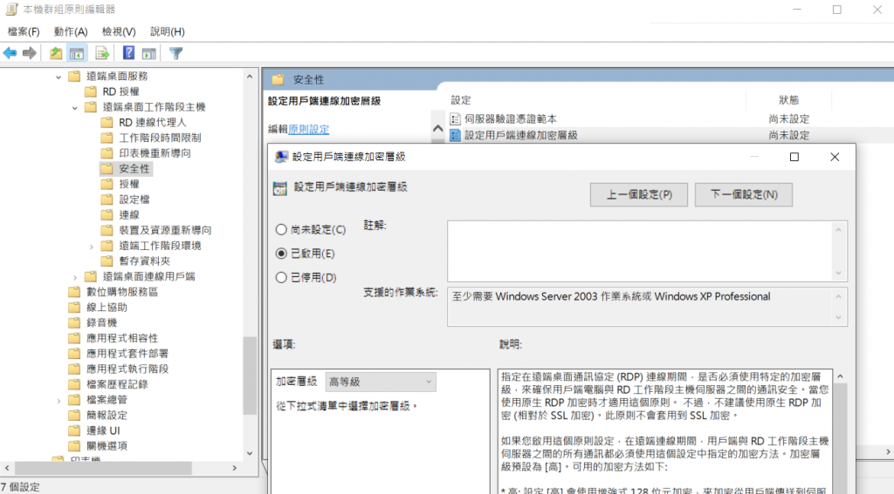
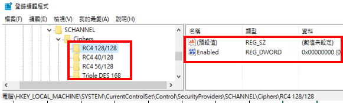

# 漏洞概要

目標主機支援使用中等強度的 SSL Ciphers。

---

# 漏洞敘述

> CVE : CVE-2016-2183

目標主機提供支持使用中等強度加密的 SSL Cipher。Nessus 將中等強度視為使用的密鑰長度至少 64-bits 且小於 112-bits 進行加密，或使用 3-DES 加密套件的任何加密。

> ⚠️如果攻擊者位於同一個物理網路上，則繞過 Medium Strength Encryption 要容易許多。

---

# 修補方式

1. 重新設置受影響的應用程式，以避免使用中等強度的密碼。

## Windows

1. 本機群組 -> 電腦設定 -> 系統範本 -> Windows 元件 -> 遠端桌面服務 -> 階段主機 -> 遠端桌面協定安全性設定為高層級。

2. 透過登錄編輯程式，移除 3-DES 演算法。

---
