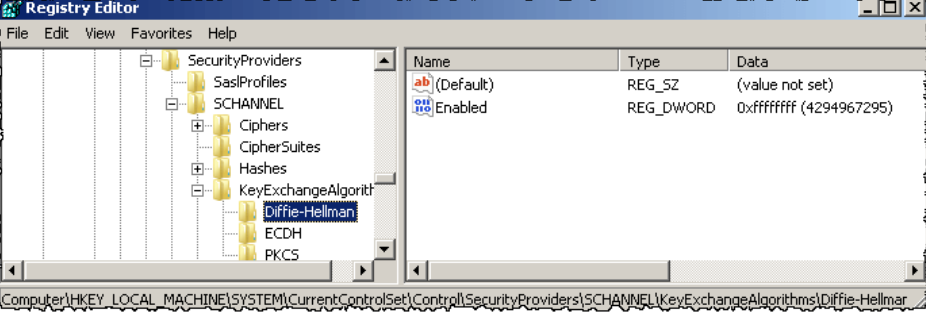

# 漏洞概要

目標主機允許使用一個或多個小於或等於 1024 bits 的 Diffie-Hellman moduli SSL/TLS 連線。

---

# 漏洞敘述

> CVE : CVE-2015-4000

目標主機允許使用一個或多個小於或等於 1024 bits 的 Diffie-Hellman moduli SSL/TLS 連線。

透過加密，第三方可以短時間找到共用密碼(取決於 Modulus Size 及攻擊者的資源)。可以讓攻擊者復原純文字或可能破壞連線的完整性。

---

# 修補方式

1. 將服務重新設定為使用 2048 位元或更多的唯一 Diffie-Hellman moduli。

## Windows

---
