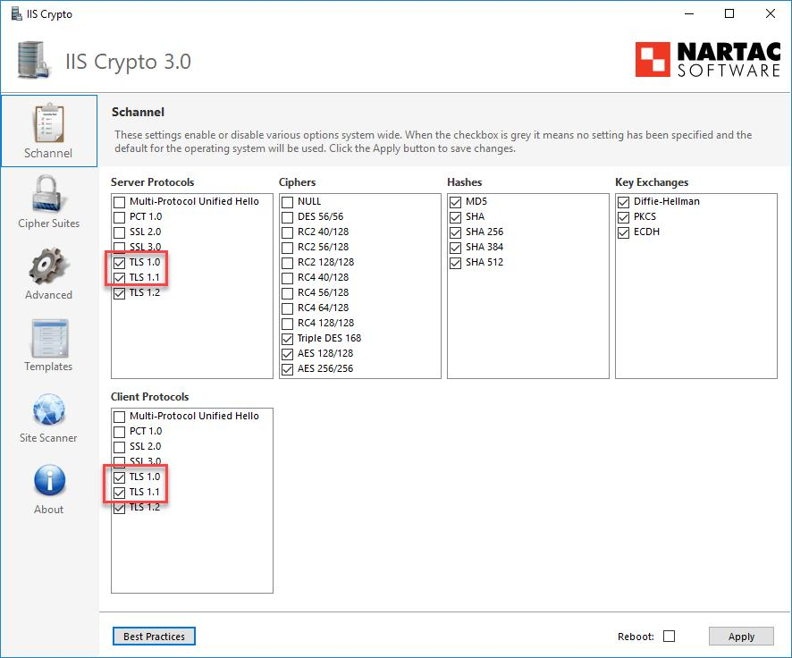

# 漏洞概要

目標主機使用較舊的 TLS Version 加密流量。


---

# 漏洞敘述

> CVE : 

目標主機接受使用 TLS 1.0 加密連線。TLS 1.0 有幾個加密設計缺陷。現今 TLS 1.0 實現方式緩解了這些問題，不過應盡可能使用 TLS 1.2, 1.3 這種特別針對這些缺陷而設計的較新 TLS Version。

自 2020/03/31 起，未啟用 TLS 1.2 和更新版本的網站，將無法再透過主要瀏覽器與主要廠商正常運作。

PCI DSS v3.2 要求必須在 2018/06/30 前完全停用 TLS 1.0，但經確認不受任何已知惡意利用危害的 POS POI 終端機(及其所連線的 SSL/TLS 終端點)除外。


---

# 修補方式

1. 啟用 TLS 1.2 與 1.3 支援，並停用 TLS 1.0 支援。

## Apache

修改 `/etc/apache2/httpd.conf`

```
# SSL Protocol support: # List the enable protocol levels with which clients will be able to # connect. Disable SSLv2 access by default: SSLProtocol all -SSLv2 -SSLv3 -TLSv1 -TLSv1.1
```

## Windows




---
