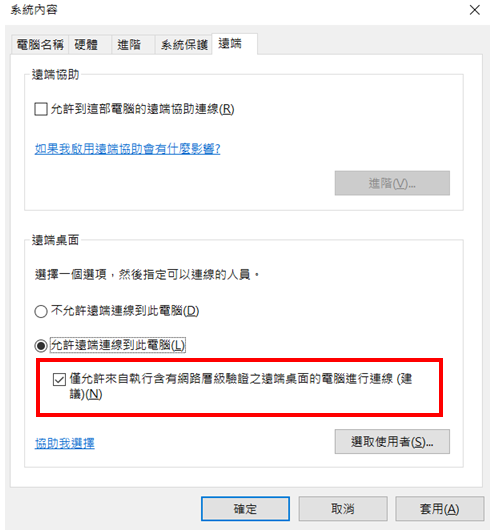

# 漏洞概要

目標主機使用弱式加密。

---

# 漏洞敘述

> CVE : 

未設定遠端終端機服務使用強式加密。

對此服務使用弱式加密可能導致攻擊者更容易竊聽通訊，並取得螢幕擷取畫面或按鍵輸入。

---

# 修補方式

1. 將 RDP 加密層級變更為以下層級之一。
        i. 3. High
        ii. 4. FIP Compliant
2. 在遠端 RDP 伺服器上啟用網路層級驗證(NLA)。一般是在 Windows 中，系統 -> 進階系統設定 -> 遠端，勾選 "僅允許來自執行含有網路層級驗證之遠端桌面的電腦進行連線"。

> 💡如果有修補該漏洞，漏洞 ID 18405, 57690 漏洞也會一併被修補。

---
