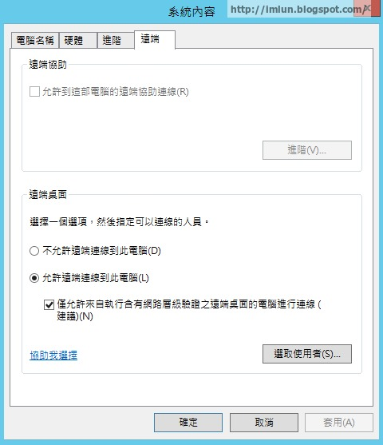

# 漏洞概要

目標主機並非僅使用網路層級驗證。

---

# 漏洞敘述

> CVE : 

目標主機被非設定為僅使用網路層級驗證(NLA)。NLA 使用 CredSSP(Credential Secuity Support Provider, 認證安全性支援提供者) 通訊協定，透過 TLS/SSL 或 Kerberos 機制執行強式伺服器驗證，以防範攔截式(MiTM)攻擊。

除了改善驗證，NLA 也可先完成使用者驗證，再建立完整的 RDP 連線，這有助於防護目標主機免遭惡意使用者和軟體入侵。

---

# 修補方式

1. 在遠端 RDP 伺服器上啟用網路層級驗證(NLA)。一般是在 Windows 中，系統 -> 進階系統設定 -> 遠端，勾選 "僅允許來自執行含有網路層級驗證之遠端桌面的電腦進行連線"。

> 💡如果有修補該漏洞，漏洞 ID 18405 漏洞也會一併被修補。

---
